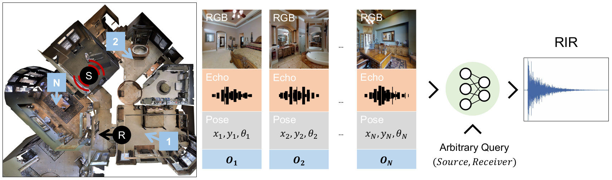

# Few-Shot Audio-Visual Learning of Environment Acoustics
This repository contains the PyTorch implementation of our **Neurips 2022 paper** and the associated datasets: 

[Few-Shot Audio-Visual Learning of Environment Acoustics](https://vision.cs.utexas.edu/projects/fs_rir/)<br />
Sagnik Majumder, Changan Chen*, Ziad Al-Halah*, Kristen Grauman<br />
The University of Texas at Austin, Facebook AI Research  
\*Equal contribution

Project website: [https://vision.cs.utexas.edu/projects/fs_rir/](https://vision.cs.utexas.edu/projects/fs_rir/)

<p align="center">
  
</p>

## Abstract
Room impulse response (RIR) functions capture how the surrounding physical environment transforms the sounds heard by a listener, with implications for various applications in AR, VR, and robotics. Whereas traditional methods to estimate RIRs assume dense geometry and/or sound measurements throughout the environment, we explore how to infer RIRs based on a sparse set of images and echoes observed in the space. Towards that goal, we introduce a transformer-based method that uses self-attention to build a rich acoustic context, then predicts RIRs of arbitrary query source-receiver locations through cross-attention. Additionally, we design a novel training objective that improves the match in the acoustic signature between the RIR predictions and the targets. In experiments using a state-of-the-art audio-visual simulator for 3D environments, we demonstrate that our method successfully generates arbitrary RIRs, outperforming state-of-the-art methods and---in a major departure from traditional methods---generalizing to novel environments in a few-shot manner.

## Dependencies
This code has been tested with ```python 3.6.13```, ```habitat-api 0.1.4```, ```habitat-sim 0.1.4``` and ```torch 1.4.0```. Additional python package requirements are available in ```requirements.txt```.   
  
First, install the required versions of [habitat-api](https://github.com/facebookresearch/habitat-lab), [habitat-sim](https://github.com/facebookresearch/habitat-sim) and [torch](https://pytorch.org/) inside a [conda](https://www.anaconda.com/) environment. 

Next, install the remaining dependencies either by 
```
pip3 install -r requirements.txt
``` 
or by parsing ```requirements.txt``` to get the names and versions of individual dependencies and install them individually.

For ```speechmetrics```, install it from this [repo](https://github.com/aliutkus/speechmetrics).

## Datasets
Download the Few-shot-RIR-specific datasets from [this link](https://tinyurl.com/zvuwr3fk), extract the zip, copy the ```data``` directory and paste it under the project root. The extracted ```data``` directory should have 6 subdirectories
1. **audio_data**: the sinusoidal sweep audio for computing IRs and anechoic audio for computing
MOSE    
2. **compute_mos**: pickle files containing the mapping between different query source-receiver
pairs to the corresponding LibriSpeech anechoic audio for computing MOS  
3. **eval_arbitraryRIRQuery_datasets**: pickle files that define a uniformly sampled context and queries for deterministic evaluation
4. **metdata**: pickle file that gives the subgraph index for every node in a scene
5. **valid_poses**: pickle files that contain just echo IR poses (source = receiver) or give the split of arbitrary IR poses for train, seen enviroment and unseen environment eval
6. **cached_room_acoustic_parameters**: pickle files that contain the channelwise RT60 and DRR values for each node in a scene
    
 Download the [SoundSpaces](https://github.com/facebookresearch/sound-spaces/blob/main/soundspaces/README.md) Matterport3D **binaural RIRs** and **metadata**, and extract them into directories named ```data/binaural_rirs/mp3d``` and ```data/metadata/mp3d```, respectively.    
     
Download the [Matterport3D](https://niessner.github.io/Matterport/) dataset, and cache the observations relevant for the SoundSpaces simulator using [this script](https://github.com/facebookresearch/sound-spaces/blob/main/scripts/cache_observations.py) from the [SoundSpaces repository](https://github.com/facebookresearch/sound-spaces). Use resolutions of ```128 x 128``` for both RGB and depth sensors. Place the cached observations for all scenes (.pkl files) in ```data/scene_observations/mp3d```.  

For further info about the structuring of the associated datasets, refer to ```rir_rendering/config/default.py``` or the task configs.

## Code
###### Training    
8 GPU DataParallel training: 
```
CUDA_VISIBLE_DEVICES=0,1,2,3,4,5,6,7 python3 main.py --exp-config rir_rendering/config/train/uniform_context_sampler.yaml --model-dir runs/fs_rir --run-type train NUM_PROCESSES 1
``` 

###### Testing       
8 GPU DataParallel testing:   
1. **Seen environments**  
```
CUDA_VISIBLE_DEVICES=0,1,2,3,4,5,6,7 python3 main.py --exp-config rir_rendering/config/test/uniform_context_sampler.yaml --model-dir runs_eval/fs_rir --run-type eval EVAL_CKPT_PATH_DIR runs_eval/fs_rir/data/seen_eval_best_ckpt.pth NUM_PROCESSES 1
```  

2. **Unseen environments**  
```
CUDA_VISIBLE_DEVICES=0,1,2,3,4,5,6,7 python3 main.py --exp-config rir_rendering/config/test/uniform_context_sampler.yaml --model-dir runs_eval/fs_rir --run-type eval EVAL_CKPT_PATH_DIR runs_eval/fs_rir/data/unseen_eval_best_ckpt.pth NUM_PROCESSES 1
```
        
Compute eval metric values, like STFT error, RTE and DRRE, using ```scripts/impulse_quality/compute_evalMetrics.ipynb```, and MOSE using ```scripts/impulse_quality/mos/run_mos.py``` and ```scripts/impulse_quality/mos/compute_mose.ipynb```. Additionally, for computing MOS and subsequently MOSE the ```UniformContextSampler.dump_audio_waveforms``` flag in ```rir_rendering/config/test/uniform_context_sampler.yaml``` should be set to ```True``` for dumping the prediced and ground-truth IRs to disk.

**Notes:** 
1. metric values reported in the paper are median values.
2. The model converges around 120-140 epochs; the next arxiv version will be updated to reflect that

## Model checkpoints
Download model checkpoints from this [link](https://tinyurl.com/dphrmz59).    

## Citation
```
@inproceedings{
majumder2022fewshot,
title={Few-Shot Audio-Visual Learning of Environment Acoustics},
author={Sagnik Majumder and Changan Chen and Ziad Al-Halah and Kristen Grauman},
booktitle={Advances in Neural Information Processing Systems},
editor={Alice H. Oh and Alekh Agarwal and Danielle Belgrave and Kyunghyun Cho},
year={2022},
url={https://openreview.net/forum?id=PIXGY1WgU-S}
}
```

# License
This project is released under the MIT license, as found in the LICENSE file.
